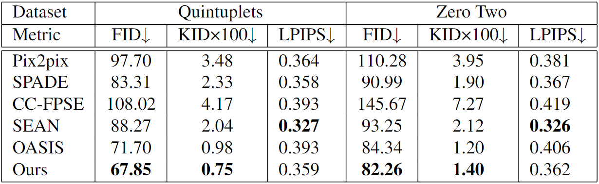

# Semantic Image Synthesis of Anime Characters Based on Conditional Generative Adversarial Networks

Official PyTorch implementation of the BMVC  2024 paper "Semantic Image Synthesis of Anime Characters Based on Conditional Generative Adversarial Networks". The code allows the users to
reproduce and extend the results reported in the study. Please cite the paper when reporting, reproducing or extending the results.

[[BMVC website](https://bmvc2024.org/proceedings/508/)] 


# Abstract
The goal of semantic image synthesis is to generate realistic images from semantic label maps. However, current approaches for generating anime characters from semantic label maps still encounter some issues, particularly the inability to directly generate a specific anime character from the semantic label map, as well as blurred colors and chaotic textures in the generated images. To address these issues, we propose a Conditional Generative Adversarial Network for Semantic Image Synthesis of Anime Characters. Specifically, in the generator, we propose character identity tensor to control the generation of specified anime characters, and introduce conditional noise to enable the generated images to have natural colors. Additionally, we redesign the discriminator as a network based on semantic segmentation and edge detection, which effectively supervises the texture details, guiding the generator to generate images with higher-quality textures. Experimental results show the superiority of our proposed method in generating specific and realistic anime characters compared to existing methods.

<p align="center">

</p>

# Datasets

The Quintuplets and Zero Two Datasets can be downloaded [here(Baidu)](https://pan.baidu.com/s/1Nn_TmOfBx3JA9peBzzTrdA?pwd=1234) or [here(Google)](https://drive.google.com/drive/folders/1i9IKMS306ZH5kcl7arMVdGD32HcVLOT1?usp=sharing)  as zip files. Copy them into the checkpoints folder (the default is `./datasets`, create it if it doesn't yet exist) and unzip them. The folder structure should be

```
datasets
├── Quintuplets                   
└── ZeroTwo
```

# Pretrained models

The checkpoints for the pre-trained models are available  [here(Baidu)](https://pan.baidu.com/s/1Nn_TmOfBx3JA9peBzzTrdA?pwd=1234) or [here(Google)](https://drive.google.com/drive/folders/1i9IKMS306ZH5kcl7arMVdGD32HcVLOT1?usp=sharing) as zip files. Copy them into the checkpoints folder (the default is `./checkpoints`, create it if it doesn't yet exist) and unzip them. The folder structure should be

```
checkpoints
├── quintuplets                 
└── zero_two
```

You can generate images with a pre-trained checkpoint via `test.py`. 

The example of Quintuplets:

```
python test.py --class_num 9  --name quintuplets --class_dir ./datasets/Quintuplets/class.txt \
--ckpt_iter 140000 --dataset_mode custom --dataroot ./datasets/Quintuplets  --batch_size 1 --gpu_ids 0
```

The example of Zero Two :

```
python test.py --class_num 15  --name zero_two --class_dir ./datasets/ZeroTwo/class.txt \
--ckpt_iter 140000 --dataset_mode custom --dataroot ./datasets/ZeroTwo  --batch_size 1 --gpu_ids 0
```

# Train the model

To train on the Quintuplets dataset, for example:

```
python train.py --name quintuplets --class_dir datasets/Quintuplets/class.txt --class_num 9 --dataset_mode custom \
--dataroot ./datasets/Quintuplets --gpu_ids 0 --num_epochs 400 --batch_size 1 --freq_print 1000 --freq_save_latest 10000
```

To train on the Zero Two dataset, for example:

```
python train.py --name zero_two --class_dir datasets/ZeroTwo/class.txt --class_num 15 --dataset_mode custom \
--dataroot ./datasets/ZeroTwo --gpu_ids 0 --num_epochs 400 --batch_size 1 --freq_print 1000 --freq_save_latest 10000
```

The `--class_dir` is the path for storing the character ID tag txt. The `--class_num`  is the number of anime characters contained in the dataset.

# Test the model

To test on the Quintuplets dataset, for example:

```
python test.py --class_num 9  --name quintuplets --class_dir ./datasets/Quintuplets/class.txt \
--ckpt_iter 140000 --dataset_mode custom --dataroot ./datasets/Quintuplets  --batch_size 1 --gpu_ids 0
```

To test on the Zero Two dataset, for example:

```
python test.py --class_num 15  --name zero_two --class_dir ./datasets/ZeroTwo/class.txt \
--ckpt_iter 140000 --dataset_mode custom --dataroot ./datasets/ZeroTwo  --batch_size 1 --gpu_ids 0
```

# Result
Our method generates images with higher quality colors and more natural textures compared to previous methods
<p align="center">

</p>

<p align="center">

</p>

Our method has better results on FID and KID compared to previous methods, and has second best results on LPIPS

<p align="center">

</p>

# Contact

If you have any questions, please create an issue on this repository or contact us at 
Xuhui Zhu [904749952@qq.com](904749952@qq.com)

Jing Wen  [wj@cqu.edu.cn](wj@cqu.edu.cn)


# Citation

If you use this work please cite
```
@inproceedings{Zhu_2024_BMVC,
author    = {Xuhui Zhu and feng jiang and Jing Wen and yi wang and qiang gao},
title     = {Semantic Image Synthesis of Anime Characters Based on Conditional Generative Adversarial Networks},
booktitle = {35th British Machine Vision Conference 2024, {BMVC} 2024, Glasgow, UK, November 25-28, 2024},
publisher = {BMVA},
year      = {2024},
url       = {https://papers.bmvc2024.org/0508.pdf}
}
```

# Acknowledgement

This code is based on [https://github.com/boschresearch/OASIS](OASIS)

The Quintuplets dataset was collected from the popular anime work [五等分の花嫁](https://www.tbs.co.jp/anime/5hanayome/)

The Zero Two datase was collected from the popular anime work [DARLING in the FRANXX](https://en.cloverworks.co.jp/works/darlifra/)

# License

This project is open-sourced under the AGPL-3.0 license. See the
[LICENSE](LICENSE) file for details.

For a list of other open source components included in this project, see the
file [3rd-party-licenses.txt](3rd-party-licenses.txt).
